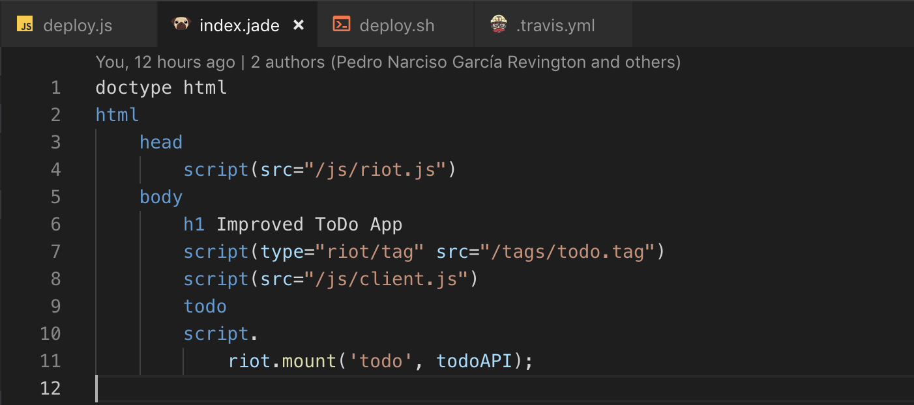
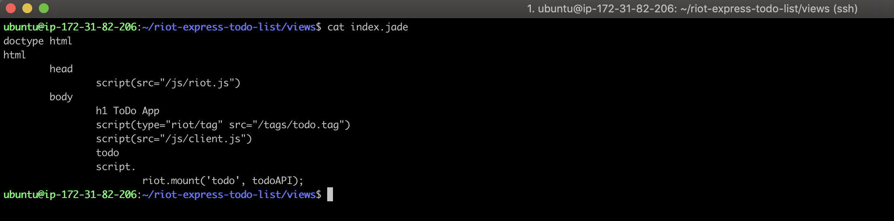

# Lesson 3 Hands-On  (13 points)

## Directions

For this Hands-On, you will continue to work with the `todo-list` project
you used in the Lesson 1 and 2 Hands-Ons. `This Hands-On will be graded`,
so be sure you complete all requirements.

---

## Setup

* You will be working with your `deployment-handson-two` project for this Hands-On.

    * Make a copy and rename it `deployment-handson-three`.
    
## Requirements

* Make sure the `deploy.js` file for this project matches the `hackathon-starter`
deploy.js file.

    * **IMPORTANT:** Make sure to change the `hackathon-starter-temp` and
    `hackathon-starter` naming conventions to `riot-express-todo-list-temp` and
    `riot-express-todo-list` where needed.

* Add the `.sh` file

* Add the `.yml` file

* Connect Travis CI to the `todo-list` repository

* Update `.yml` file

Make a change to the file to be sure that Travis CI is automatically deploying
your project.

# PROJECT NOTES:

The most important point to emphasize on this project is that although I was
able to make an automated build of the riot-express-todo-list, the change that
I had made to the **index.jade** file locally, were not reflected in the
rebuilt application on the **EC2** server.

This fact is demonstrated by this screenshot, which shows the change made
locally:

Line 6 clearly shows that the `<h1>` heading was changed by inserting the word
**Improved** before **ToDo**.

This screenshot, compared with the next one shows clearly that this change was
not updated by **Travis CI**:

Clearly, the line that specifies the `<h1>` heading in this remote file does _not_
reflect the change made in the screenshot above.

Despite this problem, clearly the automated update _did_ work.

## Index of Screenshots

##### NOTE: All screenshots listed below may be found in `deploy-handson-three/screenshots` folder.

1. **travis-ci-step1.png:** Login screen for **AWS Educate**.

1. **travis-ci-step2.png:** Secondary Login screen for **AWS Educate**.

1. **travis-ci-step3.png:** **AWS Educate** landing page.

1. **travis-ci-step4.png:** **AWS Educate** page with link to **Starter Account**.

1. **travis-ci-step5.png:** **Third Party Starter Account** page (Vocareum).

1. **travis-ci-step6.png:** **AWS Management Console** page with available services.

1. **travis-ci-step7.png:**. **EC2 Management Console** page.

1. **travis-ci-step8.png:** **EC2 Management Console** showing two inactive
server instances.

1. **travis-ci-step9.png:** **EC2 Management Console** showing startup of server
instance for ToDo application.

1. **travis-ci-step10.png:** **EC2** management console showing active sever
running **ToDo** application.

1. **travis-ci-step11.png:** Secure Shell Login to **EC2** server.

1. **travis-ci-step12.png:** Created `deploy.sh` shell script.

1. **travis-ci-step13.png:** `index.jade` file prior to local change.

1. **travis-ci-step14.png:** **Travis CI** build following push to Github.

1. **travis-ci-step15.png:** **Travis CI** build showing normal exit status.

1. **travis-ci-step16.png:** Changed to `riot-express-todo-list` directory and
ran `npm start`.

1. **travis-ci-step17.png:** Visited application on live **EC2** server, confirming
that local change to `index.jade` did not get deployed. to **EC2** server.

1. **travis-ci-step18.png:** `index.jade` template showing local change (added the
word **Improved** to `<h1>` heading).

1. **travis-ci-step19.png:** `cat index.jade` on remote **EC2** server confirms
that local change shown in **travis-ci-step18.png** was not deployed.
